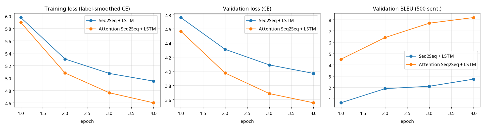
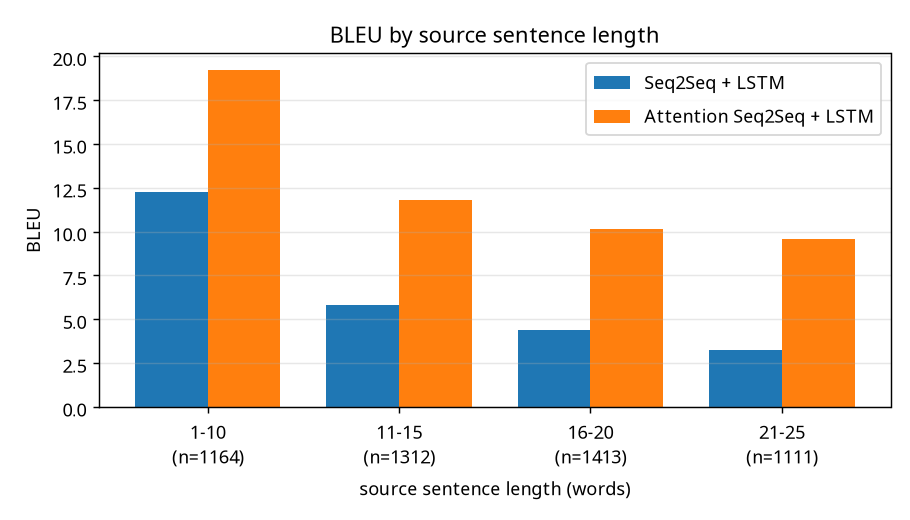
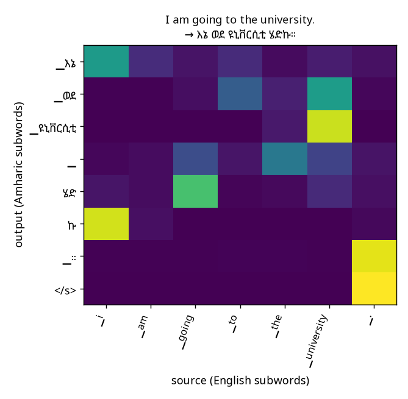
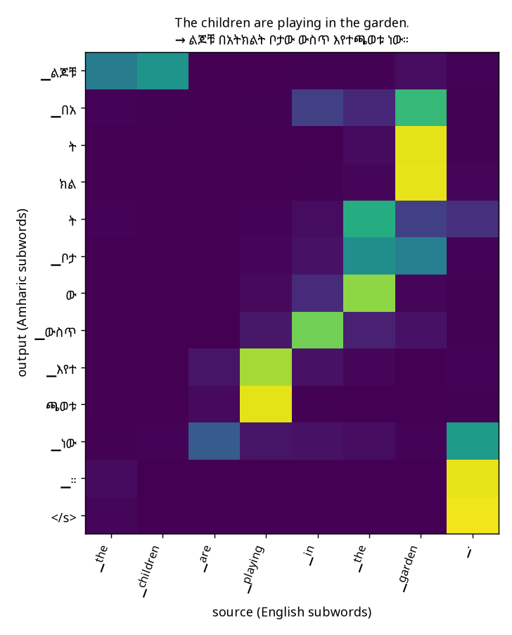
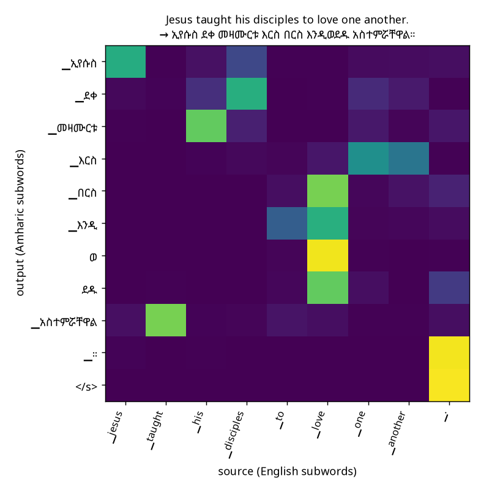
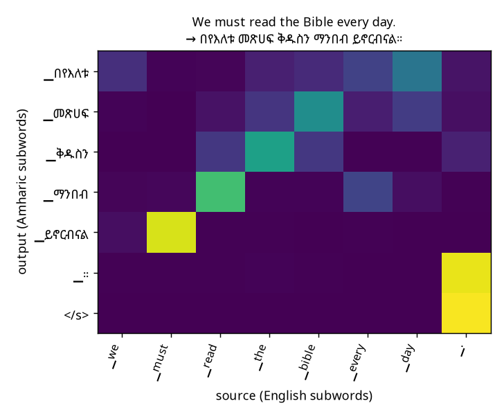

# English → Amharic Neural Machine Translation: Seq2Seq-LSTM vs Attention-LSTM

**Deep Learning Course Project — Technical Report**
Instructor: Fantahun Bogale Gereme

**Group members:** Bethel Negusu (GSR/8221/18) · Esrom Adugna (GSR/4064/18) · Selamawit Siferh (GSR/6879/18) · Aklilu Solomon (GSE/0756/18)

---

## Abstract

We build, evaluate, compare and deploy an English→Amharic neural machine translation system.
Two recurrent models are trained on the same data under the same compute budget: a **basic
Seq2Seq + LSTM** encoder–decoder (the only link between encoder and decoder is the final
hidden state) and an **Attention-based Seq2Seq + LSTM** (Luong global attention).

Training data is 517k sentence pairs from two public corpora: OPUS MT560, which is mostly religious
text, and habtew/english-amharic-translation, which adds news and everyday sentences. After an error
analysis, both models were fine-tuned on 647 hand-checked pairs for everyday verbs (play, cook, eat, read, …),
"garden" and negation (§2.4). Output is decoded with tuned beam search.

On a held-out test set of 5,000 sentences:

| | BLEU | chrF | Test perplexity |
|---|---:|---:|---:|
| Seq2Seq + LSTM | 5.26 | 13.68 | 40.1 |
| **Attention + LSTM** | **11.35** | **23.13** | **24.2** |

The attention model has only 2.5 % more parameters. It wins in every sentence-length bucket and on both
data sources, and copies numbers correctly 98 % of the time (baseline 71 %). The best model is served through
a FastAPI `POST /translate` endpoint with a Gradio UI, and through a public browser demo that runs the model
client-side with ONNX Runtime Web.

> **Version note.** A first version of this project used MT560 only, 4 epochs (2.5 h) and greedy
> decoding, and reached 8.57 BLEU / 19.46 chrF with the attention model. It failed on everyday
> sentences, e.g. *"I am going to the university."* → *"እኔ ደግሞ በስሜት ቆየሁ"*. This report describes the
> improved versions: more data, 7 h of training and beam search (v2), plus targeted fine-tuning on curated
> everyday pairs (v3). Now *"I am going to the university."* → *"እኔ ወደ ዩኒቨርሲቲ ሄድኩ።"* ("I went to the
> university"), and *"The children are playing in the garden."* → *"ልጆቹ በአትክልት ቦታው ውስጥ እየተጫወቱ ነው።"*.
> The test sets differ (the newer one also contains habtew sentences), so the version-1 numbers are
> only a rough reference.

---

## 1. Dataset & preprocessing

### 1.1 Sources and licenses
| Corpus | Hugging Face ID | Content | License | Raw pairs |
|---|---|---|---|---:|
| **OPUS MT560** (main) | [`michsethowusu/english-amharic_sentence-pairs_mt560`](https://huggingface.co/datasets/michsethowusu/english-amharic_sentence-pairs_mt560), from [OPUS MT560](https://opus.nlpl.eu/MT560) | Bible, Qur'an, Watchtower/Awake! publications, software strings | **CC-BY-4.0** | 669,145 |
| **habtew** (added) | [`habtew/english-amharic-translation`](https://huggingface.co/datasets/habtew/english-amharic-translation) (train + validation + test merged, then re-split) | news, government texts, everyday sentences, plus religious text | *not stated on the dataset card*; used here for non-commercial coursework only | 237,243 |

habtew was added because the first version showed that a purely religious corpus cannot translate
everyday sentences.

### 1.2 Size and characteristics (raw, combined)
| Property | Value |
|---|---|
| Sentence pairs | 906,388 |
| Mean / median / max English tokens | 20.7 / 19 / 269 |
| Mean / median / max Amharic tokens | 14.2 / 13 / 227 |
| English word types | 181,960 |
| Amharic word types | 504,603 |

Observations:
* **Domain:** still dominated by religious text. After de-duplication, 83 % of the training pairs come
  from MT560 and 17 % from habtew. The two corpora overlap heavily, since both contain Watchtower texts.
* **Morphology:** Amharic has about 3× more word types than English for the same content. It is highly
  inflected: subject/object agreement, prepositions and possessives attach to the word
  (e.g. *አስተምሯቸዋል* = "he taught them").
* **Word order:** English is SVO; Amharic is **SOV** with the verb at the end of the sentence.
* **Noise:** MT560 is pre-tokenized ("God 's"). There are Ge'ez punctuation variants (`፡፡` vs `።`),
  Bible footnote markers (`* ፍ1 *`), misaligned pairs, pairs in the wrong script, and many duplicates
  between the two corpora.

### 1.3 Cleaning & normalization (`src/preprocess.py`, `src/text.py`)
| Step | Pairs left |
|---|---:|
| Raw (both corpora) | 906,388 |
| Drop missing / empty | 906,386 |
| Drop exact duplicate pairs | 884,756 |
| Remove footnote markers; drop wrong-script pairs (EN must have no Ge'ez, AM must be ≥ 90 % Ge'ez letters) | 878,906 |
| Normalize; keep 2–25 tokens per side and an AM/EN length ratio in [0.3, 1.6] (removes misalignments) | 583,019 |
| De-duplicate normalized pairs; keep one translation per English source | **525,095** |

**English normalization:** Unicode NFKC, unified quotes and dashes, lower-casing, and every punctuation
character split off as its own token. This makes raw user input ("God's") match the pre-tokenized
corpus ("God 's").

**Amharic normalization:** NFC, `፡፡` / `::` → `።`, punctuation split off, and the standard **homophone
normalization** used in Amharic NLP: ሐ/ኀ/ሃ → ሀ, ሠ → ሰ, ዐ/ኣ → አ, ፀ → ጸ (all seven vowel orders), plus
a few labialized forms. Output therefore uses normalized, not always official, spelling.

Keeping one translation per English source guarantees that **no test source sentence occurs in training**.

### 1.4 Tokenization & vocabulary
**SentencePiece unigram** models (identity normalization, digits split), trained on the training split
only, one per language. Each has a vocabulary of **8,000** pieces, including `<pad>=0, <unk>=1, <s>=2,
</s>=3`. The mean is 17.0 English and 16.7 Amharic subwords per training sentence. Subwords let the
decoder build rare inflected Amharic forms from pieces, and keep the output layer small enough for CPU training.

### 1.5 Split
Random shuffle (seed 42) after de-duplication:

| Split | Pairs | from MT560 | from habtew | Mean EN / AM tokens |
|---|---:|---:|---:|---|
| Train | 517,095 | 428,957 | 88,138 | 15.2 / 11.0 |
| Validation | 3,000 | 2,479 | 521 | 15.1 / 10.9 |
| Test | 5,000 | 4,229 | 771 | 15.4 / 11.1 |

---

## 2. Model development & training

### 2.1 Architectures (`src/models.py`)
Both models share **the same encoder**, so the comparison isolates the effect of attention.

* **Encoder:** embedding (256) → 2-layer **bidirectional LSTM** (128 units per direction = 256). The final
  forward/backward states of each layer are concatenated to initialise the decoder.
* **Basic Seq2Seq + LSTM** (Sutskever et al., 2014): a 2-layer LSTM decoder (256) initialised with the
  encoder's final states. It sees nothing else from the source, so the whole sentence must fit in a
  fixed-size vector. Output: `Linear(256 → 8000)` + softmax.
* **Attention Seq2Seq + LSTM** (Luong et al., 2015, global "general" attention): the same decoder, plus at
  every step *t*:
  * `score(h_t, h̄_s) = h_tᵀ W_a h̄_s`, `a_t = softmax(score)` over all source positions (padding masked)
  * `c_t = Σ_s a_t,s h̄_s` (context vector), `h̃_t = tanh(W_c [h_t ; c_t])`, `p(y_t) = softmax(W_o h̃_t)`

  This adds only `W_a` (256×256) and `W_c` (512×256), i.e. +196k parameters (+2.5 %). Input feeding was
  left out so the whole target sequence runs through the LSTM in one call, which is 2× faster on CPU.

### 2.2 Training configuration (`src/train.py`)
| Hyper-parameter | Value (both models) |
|---|---|
| Embedding size | 256 (source and target) |
| Hidden units | 256 (encoder: 2 × 128 bidirectional; decoder: 256) |
| Layers | 2 encoder + 2 decoder |
| Dropout | 0.3 (embeddings, between LSTM layers, before output) |
| Batch size | 128 sentence pairs, length-bucketed |
| Optimizer | Adam, learning rate 1e-3, ReduceLROnPlateau (×0.5, patience 0) on validation loss |
| Loss | Token-level cross-entropy with label smoothing 0.1, padding ignored (test loss reported **without** smoothing) |
| Gradient clipping | global norm 1.0 |
| Teacher forcing | 100 % during training |
| Epochs | 12 planned; stopped by a **7-hour budget** per model → 5 full epochs + 50–63 % of the 6th |
| Hardware | 4-core CPU, no GPU; both models trained in parallel with 2 threads each |
| Checkpointing | best validation-loss model saved as `models/{seq2seq,attention}.pt`; resumable state every 250 steps |



The attention model is ahead from the first epoch (validation BLEU 7.5 vs 2.3 after epoch 1, and 11.4 vs 6.4
at the end). Both validation losses were still decreasing slowly when the budget ran out.

### 2.3 Decoding: beam search (`beam_search` in `src/models.py`)
Beam search (k = 5) with GNMT length normalization `score / ((5+|y|)/6)^α` and optional **n-gram
blocking**: an output subword 3-gram may occur only once. α and the blocking were tuned on 500 validation
sentences with the attention model, and the same settings are used for both models
([`results/decoding_tuning.json`](../results/decoding_tuning.json)):

| Setting (validation) | BLEU |
|---|---:|
| greedy | 11.39 |
| beam 5, α = 0.2 | 12.15 |
| beam 5, α = 0.7 (± blocking) | 12.54 / 12.56 |
| beam 5, α = 1.0, no blocking | 12.77 |
| **beam 5, α = 1.0, 3-gram blocking (chosen)** | **12.70** |

Blocking is chosen because it is within 0.2 BLEU of the best setting while removing visible "word word word"
loops (see §4). The same algorithm is re-implemented in JavaScript for the browser demo (`web/beam.js`).
It gives identical outputs to the Python version on 50/50 test sentences.

### 2.4 Targeted data augmentation and fine-tuning (`src/augment.py`, `src/finetune.py`)
The error analysis showed that some everyday words are learned badly because their training pairs are
unreliable. For example, of the 205 training pairs that contain *playing*, 104 have an Amharic side without
the verb ጫወት at all (loose or misaligned translations). And *garden* is translated as ገነት ("paradise",
from the Bible) in 227 of its 522 pairs. As a result, *"The children are playing in the garden."* came out as
*"ልጆች ገነት በምትሆነው ገነት ውስጥ ናቸው"* ("the children are in the paradise that is paradise").

`src/augment.py` therefore generates **761 correct pairs** (`data/curated/play_garden.tsv`) from templates
with explicit subject–verb agreement for 15 subjects (I/we/he/she/they, *the children*, *my mother*, …).
They cover:
* *play* in progressive, past and negative forms (*እየተጫወቱ ነው / ተጫወቱ / እየተጫወቱ አይደሉም*), with places,
  games and friends;
* *garden* → የአትክልት ቦታ;
* six other everyday verbs (cook, eat, read, write, work, study, run), so that the model does not
  over-generalise "playing" to every action. A first attempt with *play* only did exactly that:
  *"My mother is cooking dinner"* → *"… ኳስ እየተጫወተች ነው"* ("… is playing ball").

Each model is fine-tuned from its final checkpoint on the curated pairs, repeated and mixed with 40,000
random original training pairs to prevent forgetting. Adam, lr 2·10⁻⁴; 15 % of the curated pairs are held
out to test generalisation:

| | Attention (10× repetition, 3 epochs, 12.2 min) | Seq2Seq (2× repetition, 1 epoch, 3.7 min) |
|---|---:|---:|
| BLEU on held-out curated sentences (before → after) | 3.84 → **100.0** | 1.25 → **15.29** |
| Validation loss on the original data (before → after) | 3.1565 → 3.1429 | 3.6506 → 3.6424 |

The attention model learns the pattern from a few hundred examples and generalises to unseen combinations,
including word order in questions (*"Where are the children playing?"* → *"ልጆቹ ወዴት እየተጫወቱ ነው?"*). The
basic Seq2Seq model could only take a light dose. With stronger fine-tuning (5–20× repetition) it started
inserting the curated verbs into unrelated sentences (*"We must read the Bible every day"* →
*"… እየተጫወትን ነው"*), so the gentler setting was kept. This is another illustration of the fixed-vector
bottleneck: without attention, the decoder relies more on frequent target patterns than on the source.
The original 5,000-sentence test set (§3) is unchanged, and test scores did not drop (attention 11.27 → 11.35 BLEU).

---

## 3. Evaluation & comparison (`src/evaluate.py`)

Test set: 5,000 sentences. BLEU and chrF are corpus-level scores from sacrebleu 2.6 on normalized,
punctuation-tokenized Amharic.

| Metric | Seq2Seq + LSTM | Attention Seq2Seq + LSTM |
|---|---:|---:|
| **BLEU** (beam search) ↑ | 5.26 | **11.35** |
| **chrF** (beam search) ↑ | 13.68 | **23.13** |
| BLEU / chrF with greedy decoding | 4.91 / 13.5 | 10.36 / 22.04 |
| **Test loss (CE)** ↓ | 3.691 | **3.187** |
| Test perplexity ↓ | 40.1 | **24.2** |
| **Parameters** | 7,995,200 | 8,191,808 |
| Model size | 30.5 MB | 31.3 MB |
| **Training time** | 420 min (6 epochs*) + 3.7 min fine-tuning | 420 min (6 epochs*) + 12.2 min fine-tuning |
| **Inference time**, whole test set, greedy (batch 100) | **10.0 s** | 11.1 s |
| Inference time, whole test set, beam search (one sentence at a time) | 175 s | 186 s |
| Inference per sentence, greedy batched | **2.0 ms** | 2.22 ms |
| Inference per sentence, beam search (API setting) | **33 ms** | 36 ms |

\* the 6th epoch was partial (see §2.2).

**BLEU by data source (beam search)**

| Test subset | n | Seq2Seq | Attention |
|---|---:|---:|---:|
| MT560 (religious) | 4,229 | 4.75 | **10.49** |
| habtew (news / everyday / religious) | 771 | 8.07 | **16.3** |

**The attention model is clearly better:** +6.1 BLEU (2.2× the baseline) and +9.4 chrF, with a much lower
perplexity for almost the same number of parameters. Beam search adds about +1.0 BLEU to each model over
greedy decoding. Attention costs roughly 3 ms more per sentence with beam search on CPU, which does not
matter for an interactive application.

**Effect of the improvements (attention model):**

| Version | Data | Training | Decoding | BLEU | chrF |
|---|---|---|---|---:|---:|
| v1 | MT560 (428k) | 4 epochs, 2.5 h | greedy | 8.57 | 19.46 |
| v2 | MT560 + habtew (517k) | 6 epochs, 7 h | greedy | 10.23 | 21.62 |
| v2 | MT560 + habtew (517k) | 6 epochs, 7 h | beam search | 11.27 | 22.84 |
| **v3** | + 761 curated pairs (fine-tuning, §2.4) | + 12.2 min | **beam search** | **11.35** | **23.13** |

BLEU is still low in absolute terms. That is expected for small LSTMs trained on a CPU for a few hours, with
a morphologically rich target language where one wrong affix makes the whole word count as a BLEU miss. chrF,
which gives credit for partly correct words, shows the same ranking.

### 3.1 Translation examples
Source → Reference → Seq2Seq output → Attention-LSTM output (test set, beam search; 25-row table in
[`results/examples.md`](../results/examples.md); all 5,000 outputs in `results/test_predictions.tsv`).

| Source (EN) | Reference (AM) | Seq2Seq + LSTM | Attention-LSTM |
|---|---|---|---|
| if it did, could we protect ourselves? | በሽታው ቢከሰት ራሳችንን መጠበቅ እንችላለን? | እንዲህ ማድረግ የምንችለው እንዴት ነው? | ታዲያ ራሳችንን መጠበቅ እንችላለን? |
| wisdom-more precious than gold | ከወርቅ ይበልጥ ውድ የሆነው ጥበብ | ጥበብን የሚያከብር ጥበብ ነው | ጥበብ - ከወርቅ ይበልጥ ውድ ሀብት |
| and on all the tribes of israel | በእስራኤል ነገዶች ሁሉ ላይ ነውና፤ | በእስራኤልም መካከል | በእስራኤልም ነገዶች ሁሉ ላይ |
| elders, for instance, are appointed by holy spirit. | ለምሳሌ ያህል፣ ሽማግሌዎች የሚሾሙት በመንፈስ ቅዱስ ነው። | ለምሳሌ ያህል፣ ሽማግሌዎች በመንፈስ ቅዱስ አማካኝነት ነው። | ለምሳሌ ያህል ሽማግሌዎች በመንፈስ ቅዱስ እየተሾሙ ነው። |
| they also began to study the bible and quit their bad associations." | በተጨማሪም መጽሀፍ ቅዱስ ማጥናትና ከመጥፎ ባልንጀሮቻቸው መራቅ ጀመሩ። " | በተጨማሪም መጽሀፍ ቅዱስን ማጥናት ጀመሩ። " | ከዚህም በተጨማሪ መጽሀፍ ቅዱስን ማጥናትና መጥፎ ጓደኞችን እያጠናኩ ነው። " |
| ex. 1: 8, 9, 13, 14. | ዘጸ 1፥ 8, 9, 13, 14 | ዘጸ 18፥ 1, 15, 38 | ዘጸ 1፥ 8, 9, 14, |
| "i stopped worrying about myself,"says shane. | ሼን " ስለ ራሴ መጨነቄን አቆምኩ " በማለት ተናግሯል። | እንዲህ ብላለች፦ " ጤንነቴን መቆጣጠር ጀመርኩ። | " ስለ ራሴ እጨነቅ ነበር " ብላለች። |

New sentences (not from the corpus):

| Input | Attention-LSTM | Seq2Seq + LSTM |
|---|---|---|
| I am going to the university. | እኔ ወደ ዩኒቨርሲቲ ሄድኩ። | እኔ ወደ ቤት ሄድኩ። |
| Jesus taught his disciples to love one another. | ኢየሱስ ደቀ መዛሙርቱ እርስ በርስ እንዲወደዱ አስተምሯቸዋል። | ኢየሱስ ደቀ መዛሙርቱን ለሌሎች ፍቅር አሳይቷል። |
| We must read the Bible every day. | በየእለቱ መጽሀፍ ቅዱስን ማንበብ ይኖርብናል። | መጽሀፍ ቅዱስ በየእለቱ መጽሀፍ ቅዱስን ማጥናት ይኖርብናል። |
| God created the heavens and the earth. | ሰማያትንና ምድርን የፈጠረው አምላክ ነው። | አምላክ ሰማያትንና ምድርን የፈጠረውን ሁሉ ያውቃል። |
| The children are playing in the garden. | ልጆቹ በአትክልት ቦታው ውስጥ እየተጫወቱ ነው። | ልጆቹ ቤት ውስጥ እየተጫወቱ ነው። |
| My mother is cooking dinner for the family. | እናቴ ለቤተሰቧ እራት እያበሰለች ነው። | እናቴ ቤት ውስጥ እየገባች ነው። |
| The children are not playing. | ልጆቹ እየተጫወቱ አይደሉም። | ልጆቹ ልጆች አይደሉም። |
| Where are the children playing? | ልጆቹ ወዴት እየተጫወቱ ነው? | ልጆች የት ናቸው? |
| My father is reading the newspaper. | አባቴ ጋዜጣ እያነበበ ነው። | አባቴ በጣም አስፈላጊ ነው። |
| The weather is very cold today. | ውሸቱ በዛሬው ጊዜ በጣም እየተስፋፋ ነው። | በዛሬው ጊዜ በጣም አስፈላጊ ነው። |

The sentences about playing, cooking and reading are covered by the curated templates (§2.4); the
last one ("The weather is very cold today.") is not, and is still wrong for both models.

---

## 4. Error & attention analysis

### 4.1 Automatic error indicators (test set, beam search)
| Error type | Indicator | Seq2Seq | Attention |
|---|---|---:|---:|
| Missing words | outputs < 70 % of reference length | 35.3 % | **22.6 %** |
| Additional words | outputs > 130 % of reference length | **7.4 %** | 7.7 % |
| (length) | mean length ratio hyp/ref (ideal 1.0) | 0.83 | **0.91** |
| Repeated words | outputs with a repeated word or bigram (beam + blocking) | **7.7 %** | 8.1 % |
| | … with greedy decoding | 22.9 % | 16.4 % |
| Incorrect word order | mean order agreement of shared words (ideal 1.0) | 0.948 | 0.950 |
| | sentences with order agreement < 0.6 | 4.7 % | **3.7 %** |
| Incorrect morphology | output words with the right stem but the wrong inflection | **3.8 %** | 5.6 % |
| Named entities | 25 frequent names (Jehovah, Jesus, Moses, Israel, Egypt, …) correct | 82.5 % | **90.8 %** |
| Numbers | all source numbers copied correctly | 70.9 % | **98.0 %** |
| Unknown / rare words | BLEU on sentences with a word seen < 5 times in training | 1.9 | **3.9** |
| | BLEU on the other sentences | 5.7 | **12.2** |

**Long-sentence errors: BLEU by source length**

| Source length | n | Seq2Seq | Attention |
|---|---:|---:|---:|
| 1–10 words | 1,164 | 12.3 | **19.2** |
| 11–15 words | 1,312 | 5.8 | **11.8** |
| 16–20 words | 1,413 | 4.4 | **10.1** |
| 21–25 words | 1,111 | 3.3 | **9.6** |



Examples for each category are in [`results/error_analysis.md`](../results/error_analysis.md).

### 4.2 Discussion of errors
* **Long sentences.** The baseline loses 73 % of its short-sentence BLEU on 21–25-word sentences
  (12.3 → 3.3); the attention model loses 50 % (19.2 → 9.6). This is the fixed-length bottleneck: a 256-dim
  vector cannot hold a 25-word sentence, while attention can look back at any source word.
* **Missing words / under-translation.** This is the baseline's main failure: 35 % of its outputs are too
  short. It keeps the sentence type and drops content, e.g. *"if it did, could we protect ourselves?"* →
  *"እንዲህ ማድረግ የምንችለው እንዴት ነው?"* ("How can we do this?"). Beam search makes this slightly worse for
  both models, because beam search tends to prefer short outputs even with length normalization.
* **Repeated words / over-translation.** With greedy decoding 16–18 % of outputs contain a repetition
  loop. Beam search with 3-gram blocking reduces this to about 8–8 %. The remaining cases are mostly repeated
  names (*"ፕሮፌሰርና ፕሮፌሰር ፕሮፌሰር"*), where attention returns to the same source word several times.
  A coverage mechanism would address this.
* **Morphology.** 4–6 % of output words have the right stem but the wrong affix: wrong tense (*ሄድኩ*
  "I went" for "I am going"), wrong person, gender or number, or a wrong imperative (*አቋርጡ*). The attention
  model's higher rate partly reflects that it gets more *stems* right in the first place.
* **Word order.** Both models learned SOV order well: 95 % pair-wise order agreement on the words they get
  right. Order errors are not the main problem; lexical and morphological errors are.
* **Named entities & numbers.** Attention copies numbers almost perfectly (98.0 % vs 70.9 %) and names more
  reliably. The baseline remembers that a verse reference exists but often invents the digits
  (*ex. 1:8, 9, 13, 14 → ዘጸ 18፥ 1, 15, 38*). Rare names (Shane, Kelvin) are still often dropped or garbled.
* **Unknown / rare words and domain.** Sentences with rare words score about 3× lower for both models.
  Adding habtew fixed several everyday words (*university → ዩኒቨርሲቲ*). Household vocabulary such as
  *cooking dinner* or *garden* was rare or mistranslated in the data, and the model fell back to religious
  phrases (*garden → ገነት*, "paradise") until the targeted fine-tuning of §2.4. Words that the curated set
  does not cover, such as *weather*, are still wrong.
* **Negation and polarity.** *"i stopped worrying"* → *"መጨነቅ ጀመርኩ"* ("I started worrying"): a small
  lexical error that reverses the meaning, which BLEU hardly penalizes.
* **Noisy references.** Some test references are misaligned (the "professor" row above, and Qur'an verses
  with bracketed glosses). This caps achievable BLEU for any model.

### 4.3 Attention visualisations
The heatmaps are in `results/figures/attention_*.png` (rows = generated Amharic subwords, columns = English
subwords, brighter = more weight).



**"I am going to the university."** → *እኔ ወደ ዩኒቨርሲቲ ሄድኩ።* (version 1 failed on this sentence.)
The subject *እኔ* ("I") attends to *i*, *ወደ* ("to") to *university* and *to*, and *ዩኒቨርሲቲ* sharply to
*university*. The verb stem *ሄድ* ("go") attends to *going*, and the first-person suffix *ኩ* attends strongly
to ***i*** again. The model has learned that the English subject pronoun becomes a verb suffix in Amharic.
The only error is tense (past instead of progressive), a morphology error.



**"The children are playing in the garden."** → *ልጆቹ በአትክልት ቦታው ውስጥ እየተጫወቱ ነው።* (after the targeted
fine-tuning of §2.4). *ልጆቹ* attends to *the children*. The pieces of *በአትክልት ቦታው* ("in the garden")
attend to *garden* and *the*, and the postposition *ውስጥ* ("inside") to *in*. The verb *እየተጫወቱ* ("they are
playing") attends to *playing*, and the auxiliary *ነው* to ***are***. Each English word has found its
Amharic counterpart, even though Amharic puts the verb at the end.



**"Jesus taught his disciples to love one another."** → *ኢየሱስ ደቀ መዛሙርቱ እርስ በርስ እንዲወደዱ አስተምሯቸዋል።*
The alignment is clean and shows the reordering needed for **SOV** Amharic: *ኢየሱስ* → *jesus*,
*ደቀ መዛሙርቱ* → *his disciples*, *እርስ በርስ* → *one another*, *እንዲወደዱ* ("that they love each other")
→ *to love*. The main verb *አስተምሯቸዋል* ("he taught them") is generated **last** but attends back to
*taught*, the second source word. The final `።` and `</s>` attend to the English period.



**"We must read the Bible every day."** → *በየእለቱ መጽሀፍ ቅዱስን ማንበብ ይኖርብናል።*
The output starts with the time adverb *በየእለቱ* ("every day"), which attends to *day / every*. The object
*መጽሀፍ ቅዱስን* attends to *the bible*, *ማንበብ* to *read*, and the sentence-final modal verb *ይኖርብናል*
("we must") very sharply to *must*. The subject *we* has no word of its own; it appears as the suffix
*-ናል*, so no row attends strongly to *we*.

---

## 5. Deployment & application

| Component | What it does |
|---|---|
| `src/translate.py` — `Translator` | inference pipeline: normalize → SentencePiece → encoder → beam-search decoder (or greedy) → SentencePiece decode → Amharic detokenization |
| `app.py` — **FastAPI** | `POST /translate` `{"text": "...", "model": "attention" \| "seq2seq", "decoding": "beam" \| "greedy"}` → `{"translation": "...", "model": "..."}`; `POST /translate/details` (tokens, attention matrix, latency); `GET /health`; OpenAPI docs at `/docs`; input validation (empty text / > 500 characters → HTTP 400) |
| `app.py` — **Gradio** UI at `/` | text box, examples, both models' translations side by side, live attention heatmap |
| `Dockerfile` | self-contained image with the trained models, tokenizers, dependencies and inference code (Hugging Face Spaces, Render, Railway, Fly.io, local) |
| `web/` — **public browser demo** | models exported to ONNX (`src/export_onnx.py`; embedding and output matrices int8-quantized, 13 MB per model) and run in the visitor's browser with ONNX Runtime Web. Tokenizer (`web/tokenizer.js`) and beam search (`web/beam.js`) are re-implemented in JavaScript and verified against Python: 3,009 + 1,200 tokenizer cases (`tests/test_web_parity.py`) and 50 beam-search cases. Published to GitHub Pages by `.github/workflows/pages.yml` |

**Live demo:** https://esraprojects.github.io/deep_learning-amharic_translation-using-seq2seq/

Example:
```bash
$ curl -X POST localhost:7860/translate -H "Content-Type: application/json" \
       -d '{"text": "I am going to the university."}'
{"translation":"እኔ ወደ ዩኒቨርሲቲ ሄድኩ።","model":"attention"}
```

---

## 6. Conclusion and future work

With the same encoder, data, training budget and almost the same number of parameters, **adding
attention more than doubles BLEU (5.26 → 11.35) and raises chrF by 9.4 points**. The gains are largest
exactly where theory predicts: long sentences, faithful copying of numbers and names, and avoiding
under-translation.

Adding general-domain data, training 2.8× longer and using tuned beam search together improved the attention
model from 8.57 to 11.27 BLEU, and made everyday sentences such as *"I am going to the university"*
translatable. Targeted fine-tuning on 761 curated pairs fixed specific everyday patterns (play, cook,
read, *garden*, negation) without lowering test scores (11.35 BLEU). It also showed that the attention
model learns from a few hundred examples, while the basic model over-fits to them. The remaining errors are wrong Amharic inflections (especially tense), rare household
vocabulary, residual repetition and under-translation.

Future work, most promising first:
1. GPU training for more epochs and a larger hidden size (both losses were still falling).
2. Coverage / input feeding against repetition and dropped content.
3. More general-domain parallel data, and more curated pairs for frequent everyday vocabulary (§2.4).
4. A Transformer baseline for comparison.

## References
* Sutskever, Vinyals, Le (2014). *Sequence to Sequence Learning with Neural Networks.*
* Bahdanau, Cho, Bengio (2015). *Neural Machine Translation by Jointly Learning to Align and Translate.*
* Luong, Pham, Manning (2015). *Effective Approaches to Attention-based Neural Machine Translation.*
* Wu et al. (2016). *Google's Neural Machine Translation System* (length normalization).
* Kudo (2018). *Subword Regularization* / SentencePiece.
* Tiedemann (2012). *Parallel Data, Tools and Interfaces in OPUS.* · Gowda et al. (2021) *Many-to-English MT (MT560).*
* Post (2018). *A Call for Clarity in Reporting BLEU Scores* (sacrebleu); Popović (2015) *chrF.*
